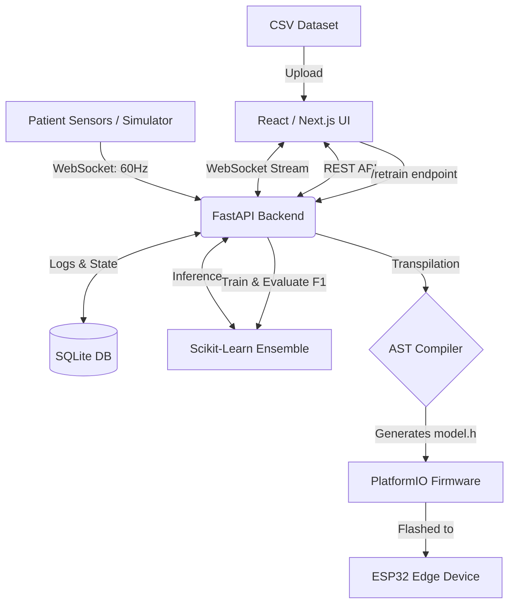

# HeartFlow OS Architecture

HeartFlow OS is a distributed Edge AI platform. It bridges the gap between high-level Python MLOps and low-level embedded systems (ESP32/Arduino) by orchestrating live telemetry, automated model training, and zero-dependency C transpilation.

## System Topology

## Directory Structure

| Directory / File | Purpose |
| :--- | :--- |
| **`backend/`** | Python FastAPI application. |
| `backend/main.py` | WebSocket router, dependency injection, and REST endpoints. |
| `backend/models.py` | MLOps script: Loads dataset, trains ensemble, checks F1 score against `registry.json`, and saves `.pkl` files on success. |
| `backend/export.py` | AST Compiler: Parses Python decision trees into `if/else` C logic. Applies INT8 quantization. |
| `backend/ensemble.py` | Soft-voting runtime inference engine. |
| `backend/test_c_export.py` | Cross-language integrity test ensuring Python models and C-code outputs match. |
| **`frontend/`** | Next.js 16 Application. |
| `frontend/src/app/layout.tsx`| Root layout containing the global telemetry socket context and universal footer. |
| `frontend/src/context/` | Contains `TelemetryContext.tsx` which manages the WebSocket stream with exponential backoff. |
| **`firmware/`** | PlatformIO C++ Project for edge microcontrollers. |
| `firmware/platformio.ini` | Build configuration for `esp32dev` with `-O3` optimization flags. |
| `firmware/src/main.cpp` | Main Arduino wrapper that includes the generated `model.h` and executes `predict()`. |
| **`docker-compose.yml`** | Full-stack orchestration configuration. |

## Data Flow: Background Retraining (MLOps)

1. User uploads a CSV via the **MLOps UI**.
2. FastAPI validates the schema and appends it to `patient_dataset.csv`.
3. A background task invokes `train_models()`.
4. A new Random Forest is trained. Its F1-score is evaluated against a test set.
5. If the new score is $\ge$ the `active_version` score in `registry.json`, the `.pkl` files are overwritten and the live Ensemble model is hot-reloaded.
6. If the new score degrades, the model is rejected (Automatic Rollback).

## Data Flow: Edge Compilation (TinyML)

1. User requests an export via the **Edge Compiler UI** (`/export_tinyml`).
2. `export.py` loads the active `.pkl` models.
3. The Scikit-Learn tree object is recursively traversed.
4. Leaf nodes are identified and converted into raw `printf` or standard `return` C-strings.
5. If `quantize=True`, 64-bit float thresholds are mapped to 8-bit integers.
6. A self-contained `model.h` file is returned, containing a single `int predict(float features[])` function. No dynamic memory (`malloc`/`free`) is used, guaranteeing memory safety on embedded controllers.
