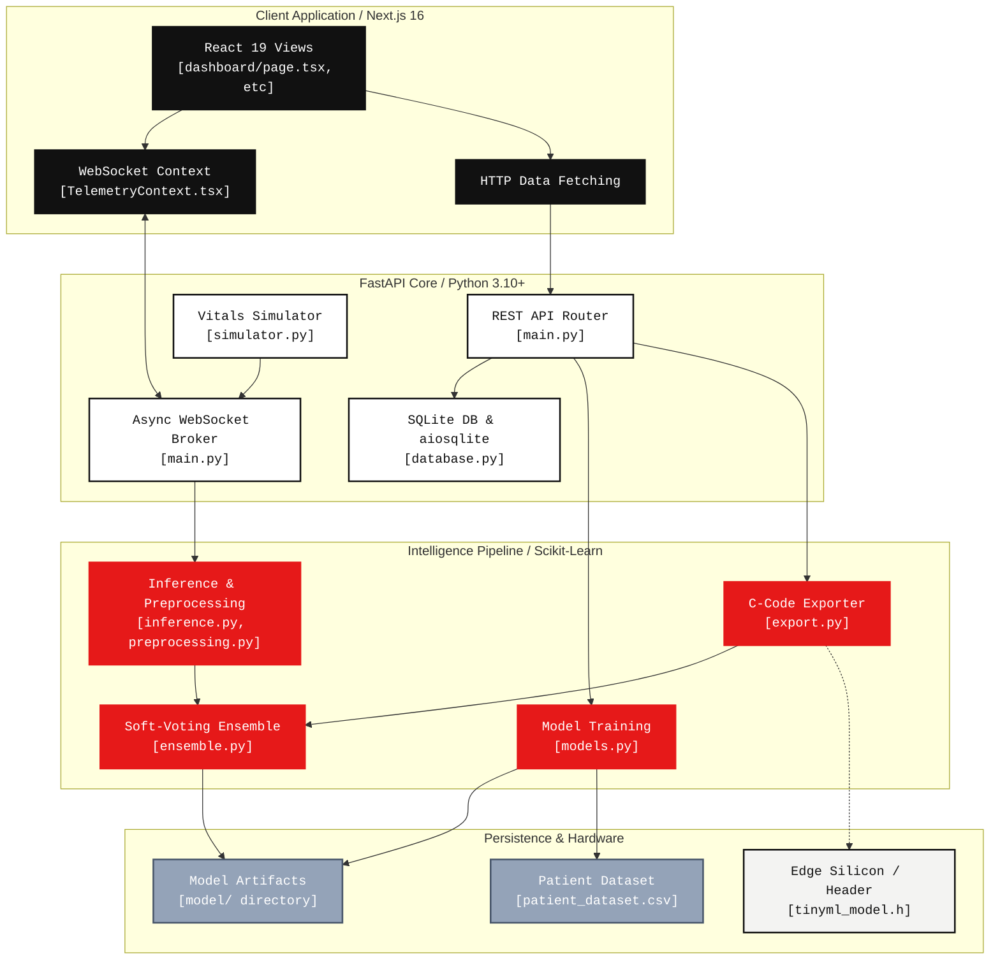

# HEARTFLOW_OS // System Architecture & Engineering Topography

## 📌 Executive Summary

HeartFlow OS is a distributed, edge-optimized telemetry pipeline designed for clinical-grade cardiovascular inference. The architecture addresses the inherent tension between heavy-compute machine learning paradigms and the constrained environments of low-power microcontrollers (TinyML).

By aggressively decoupling the presentation layer (Client), the orchestration and modeling engine (Core), and the physical target execution (Edge), the system achieves strict separation of concerns, high-throughput asynchronous concurrency, and near-zero downtime deployment of predictive models.

---

## 🏗 High-Level Architecture Diagram

---

## 1. The Presentation Layer (Client Plane)
Engineered using **Next.js 16 (App Router)** and **React 19**.

- **Rendering Strategy:** Heavily leverages React Server Components (RSC) where applicable, while isolating stateful, high-frequency telemetry updates to optimized Client Components.
- **WebSocket Triage:** Bypasses standard HTTP overhead by multiplexing telemetry streams via native WebSockets (`ws://`). The stream is mapped into a React Context provider, aggressively memoized using `useMemo` and `useCallback` to prevent unnecessary DOM re-renders and React thrashing at 60Hz.
- **Visual Engineering:** Implements an Industrial Brutalist design language. All animations and Layout Transitions are hardware-accelerated (`transform`/`opacity` driven) utilizing `framer-motion` to maintain 60fps even under heavy CPU charting loads.

## 2. The Orchestration Engine (Core Plane)
Built entirely asynchronously on top of **FastAPI** (Python 3.10+).

- **Asynchronous Throughput:** Utilizing the `asyncio` event loop and `uvicorn`, the backend comfortably supports multiple concurrent clinical WebSocket connections. I/O-bound operations (database writes) are completely non-blocking.
- **Stateful Preprocessing:** Live data must match the exact multi-dimensional space the models were trained on. The backend retains a persistent `SimpleImputer` and `StandardScaler`, ensuring live inference vectors are identical in scale to the offline batch data without runtime data leakage.
- **Event-Driven Database:** Implements `aiosqlite` for non-blocking audit logging of predictions, ensuring the primary telemetry event loop is never stalled by disk I/O.

## 3. Intelligence Pipeline & MLOps
Designed for precision and zero-downtime deployment.

- **Distributed Soft-Voting:** Rather than relying on a monolithic architecture, inference is distributed across five orthogonal models (`RandomForest`, `SVM`, `KNN`, `LogisticRegression`, `MLPClassifier`). A soft-voting aggregator calculates the weighted probability distribution, offering a confidence interval rather than a binary black-box output.
- **Live Background Retraining:** The `/retrain` pipeline exposes an API for ingesting new clinical datasets. Upon payload validation, it spins up a `fastapi.BackgroundTasks` thread. The system dynamically updates imputers, recalculates decision boundaries across all 5 models, serializes the updated weights to disk (`.pkl`), and critically—hot-swaps the active `EnsembleModel` object in RAM. This ensures active patient telemetry sessions are never dropped during model redeployments.

## 4. The Edge Compilation Pipeline (TinyML)
The most critical engineering bottleneck in telemetry is getting heavy Python models onto $2 silicon.

- **AST-Based C-Transpilation:** Instead of running a heavyweight Python interpreter (like MicroPython) on the edge device, the backend parses the scikit-learn model's internal Abstract Syntax Trees (AST) and transpiles them directly into pure, statically typed `C` functions.
- **Zero-Dependency Guarantee:** The resulting `tinyml_model.h` file requires no external libraries. It bypasses `malloc()` completely, relying entirely on static stack allocation, eliminating the risk of heap fragmentation or memory leaks in long-running embedded nodes.
- **INT8 Quantization:** 64-bit floating point weights are mathematically clamped and scaled into 8-bit integers (`int8_t`). This quantization dramatically reduces flash storage requirements by up to ~75% and massively accelerates inference execution time on ALU architectures lacking dedicated floating-point hardware (FPU).
