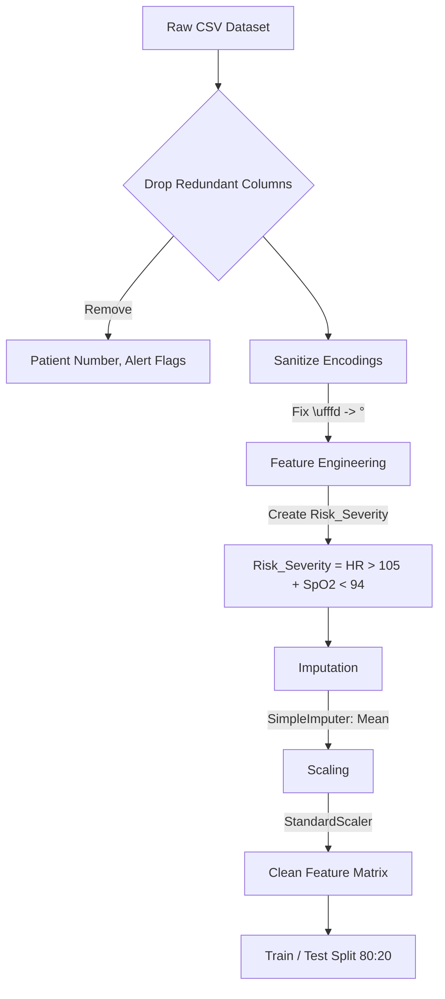
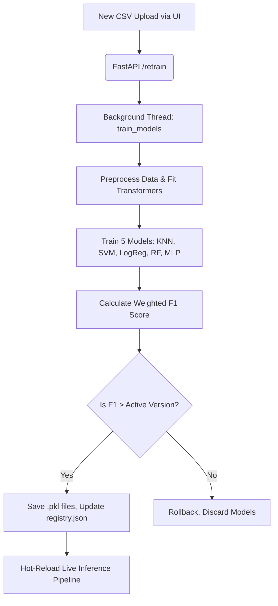
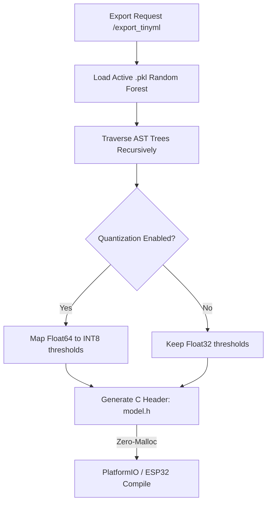

# HeartFlow OS Architecture

HeartFlow OS is a distributed Edge AI platform. It bridges the gap between high-level Python MLOps and low-level embedded systems (ESP32/Arduino) by orchestrating live telemetry, automated model training, and zero-dependency C transpilation.

## Core Flow Diagrams

### 1. Data Cleaning & Feature Selection Pipeline

### 2. MLOps Background Retraining

### 3. Edge Compilation (TinyML)

## Detailed Explanations

### Data Cleaning and Feature Selection
Raw patient data is noisy and often contains missing or invalid readings. The preprocessing pipeline (`backend/preprocessing.py`) handles this systematically:
1. **Dimensionality Reduction**: Redundant or target-leakage columns (like `Heart Rate Alert` or `Patient Number`) are dropped to prevent the model from overfitting on administrative flags.
2. **Encoding Fixes**: Unicode corruption (e.g., `\ufffd` instead of `°`) is sanitized.
3. **Imputation**: Missing sensor readings are populated using a `SimpleImputer(strategy='mean')`. The imputer is fitted on the training set and serialized to `imputer.pkl` to prevent data leakage during live inference.
4. **Feature Engineering**: A custom `Risk_Severity` feature is synthesized by combining critical thresholds: `(Heart Rate > 105) + (SpO2 < 94)`. This gives the decision trees a powerful non-linear hint.
5. **Standardization**: All continuous features are scaled to a standard normal distribution via `StandardScaler`, ensuring distance-based algorithms (like KNN and SVM) compute correctly.

### Intelligence Pipeline (Ensemble)
HeartFlow doesn't rely on a single algorithm. It trains five distinct models:
- **K-Nearest Neighbors (KNN)**
- **Support Vector Machine (SVM)**
- **Logistic Regression (LogReg)**
- **Random Forest (RF)**
- **Multilayer Perceptron (MLP Neural Network)**

During live telemetry inference (`backend/ensemble.py`), the system aggregates the probability vectors from all five models. It performs a **soft-vote**, returning the highest confidence average as the final diagnosis. 

### Fault-Tolerant Retraining (MLOps)
When a clinician uploads a new batch of data via the `/mlops` UI, the system trains the entire ensemble in a background thread without dropping live WebSocket connections. 
It evaluates the newly trained models against a 20% holdout test set. If the new `weighted F1-Score` is higher than the `active_version` tracked in `registry.json`, the `.pkl` files are hot-swapped. If the score degrades, the new models are destroyed (Automated Rollback).

### Edge Transpilation
Running Python on an ESP32 is too heavy. The `backend/export.py` script traverses the AST (Abstract Syntax Tree) of the trained Scikit-Learn Random Forest and writes pure, `if/else` C++ code into a `model.h` file. 
To shrink the firmware size by 75%, it applies **INT8 Quantization**, scaling floating-point sensor thresholds into 8-bit integers. The resulting inference function uses zero dynamic memory (`malloc`/`free`), ensuring the microcontroller never crashes from heap fragmentation.
