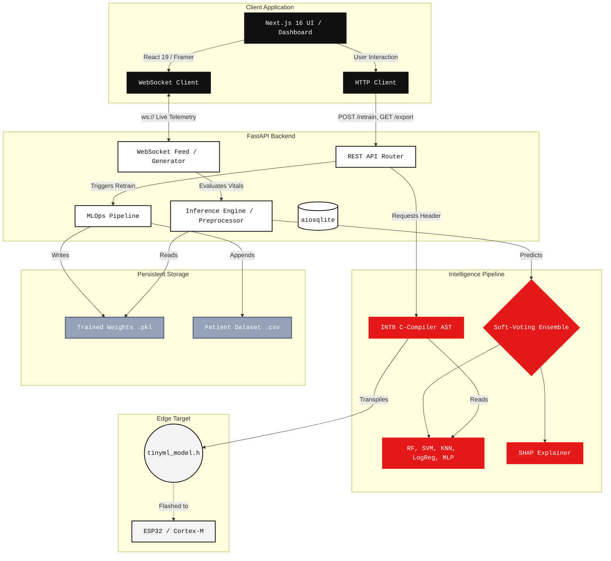

# HEARTFLOW_OS // System Architecture

## Overview
HeartFlow OS is an end-to-end, edge-optimized clinical telemetry pipeline. The system bridges the gap between high-level cloud machine learning and low-level embedded hardware, enabling real-time clinical inference and automated C-code transpilation for resource-constrained microcontrollers (TinyML).

The architecture adheres to a decoupled, modular design pattern split into three primary planes: **Client (Frontend)**, **Core (Backend)**, and **Edge (Hardware Compilation)**.

---

## Architecture Diagram

---

## 1. Client Plane (Frontend)
Engineered using **Next.js 16 (App Router)** and **React 19**. 
- **Design System:** Strict Industrial Brutalist aesthetic utilizing hard grids, monochromatic blueprints (`bg-canvas-cream`, `text-ink`), and high-contrast hazard states.
- **State Management:** React Context API manages high-frequency telemetry streams.
- **Data Transport:** Real-time data is ingested via native WebSockets (`ws://`), bypassing HTTP overhead for continuous vital monitoring.
- **Animations:** Hardware-accelerated SVG manipulations and layout transitions powered by `framer-motion`.

## 2. Core Plane (Backend)
Built on **FastAPI** (Python 3.10+), maximizing asynchronous throughput.
- **WebSocket Generator:** A state-machine driven data simulator generates correlated, volatile telemetry streams (simulating clinical episodes like Asthma or Heart Disease).
- **Inference Preprocessor:** Live patient data is standardized and imputed using a persistent `SimpleImputer` and `StandardScaler` trained on the original dataset, ensuring inference dimensions perfectly match the training phase.
- **Storage:** Employs `aiosqlite` for non-blocking, asynchronous database writes to track historical patient classifications without stalling the event loop.

## 3. Intelligence Pipeline (MLOps)
- **Ensemble Architecture:** Achieves clinical-grade precision via a 5-model soft-voting ensemble (`RandomForest`, `SVM`, `KNN`, `LogisticRegression`, `MLPClassifier`).
- **Batch Retraining:** Exposes a robust `/retrain` pipeline allowing direct CSV uploads. The pipeline safely joins the schemas, automatically updates `patient_dataset.csv`, fits new scalers/imputers, retraining all models in a `BackgroundTask` thread, and hot-swaps the `EnsembleModel` globally with zero downtime.

## 4. Edge Compilation (TinyML)
- **Zero-Dep C-Headers:** The backend transpiles trained SciKit-Learn tree models directly into standalone `C` functions. 
- **INT8 Quantization:** Floating-point weights and decision thresholds are algorithmically compressed (quantized) into 8-bit integers, effectively shrinking the flashed payload by ~75%.
- **Target:** Designed to run strictly on MCU SRAM without dynamic memory allocation (no `malloc`), perfect for resource-constrained nodes like the ESP32 or Cortex-M4.
