# Architecture: HeartFlow OS

## 1. System Overview and Goals

HeartFlow OS is a distributed Edge AI platform engineered to bridge the gap between high-level Python MLOps and resource-constrained embedded systems (ESP32/Arduino). 

**Core Architectural Objectives:**
- **Real-Time Telemetry:** Deliver a fault-tolerant, low-latency dashboard for live cardiovascular monitoring via WebSockets.
- **Automated MLOps (CI/CD for ML):** Enable seamless background model retraining, validation, and hot-swapping without interrupting active clinical inference.
- **Bare-Metal Edge Deployment:** Transpile trained Scikit-Learn ensembles into highly optimized, zero-dependency C++ code tailored for microcontrollers.

---

## 2. System Flow and Component Topology

The following diagram illustrates the boundaries and data flow between the client interfaces, API orchestration layer, ML pipelines, and data stores.

```mermaid
%% Generated by https://gitdiagram.com/idkhowtocodefr/heartflow_os
flowchart TD

subgraph group_client["Telemetry interface (Next.js)"]
  node_dashboard["Live dashboard<br/>[page.tsx]"]
  node_telemetry_context["Telemetry context"]
  node_history_ui["History view<br/>[page.tsx]"]
  node_analytics["Analytics view<br/>[page.tsx]"]
  node_simulator_ui["Simulator view<br/>[page.tsx]"]
  node_mlops_ui["MLOps view<br/>[page.tsx]"]
  node_edge_ui["Edge export view<br/>[page.tsx]"]
  node_architecture_ui["Architecture view<br/>[page.tsx]"]
  node_shap_chart["SHAP chart<br/>[ShapChart.tsx]"]
end

subgraph group_api["API orchestration (FastAPI)"]
  node_api["FastAPI routes<br/>[main.py]"]
  node_simulator["Vitals simulator<br/>[simulator.py]"]
end

subgraph group_ml["Prediction and MLOps"]
  node_inference["Inference pipeline<br/>[inference.py]"]
  node_preprocessing["Feature preprocessing<br/>[preprocessing.py]"]
  node_ensemble["Soft-voting ensemble<br/>[ensemble.py]"]
  node_training["Model training<br/>[models.py]"]
  node_export["C code exporter<br/>[export.py]"]
  node_model_files["Trained model files"]
  node_dataset["Patient dataset"]
end

subgraph group_state["Persistence and sync"]
  node_database[("Prediction history<br/>[database.py]")]
  node_sqlite[("SQLite history store<br/>[patient_history.db]")]
end

node_clinician(("Clinical user"))
node_hub["Hugging Face Hub"]

node_clinician -.->|"monitors"| node_dashboard
node_clinician -.->|"reviews"| node_history_ui
node_clinician -.->|"explores"| node_analytics
node_clinician -.->|"uses"| node_simulator_ui
node_clinician -.->|"manages"| node_mlops_ui
node_clinician -.->|"exports"| node_edge_ui
node_clinician -.->|"views"| node_architecture_ui
node_dashboard -->|"uses"| node_telemetry_context
node_clinician -.->|"submits vitals"| node_api
node_dashboard -.->|"streams telemetry"| node_api
node_history_ui -.->|"requests history"| node_api
node_analytics -.->|"requests data"| node_api
node_mlops_ui -.->|"uploads retraining data"| node_api
node_edge_ui -.->|"requests C export"| node_api
node_api -->|"initializes and queries"| node_database
node_api -->|"streams generated vitals"| node_simulator
node_api -->|"evaluates vitals"| node_inference
node_api -->|"prepares explanations"| node_preprocessing
node_api -->|"generates C code"| node_export
node_api -->|"loads and refreshes"| node_ensemble
node_api -->|"starts background retraining"| node_training
node_inference -->|"transforms features"| node_preprocessing
node_inference -.->|"predicts probabilities"| node_ensemble
node_ensemble -->|"resolves model directory"| node_preprocessing
node_training -->|"splits and transforms data"| node_preprocessing
node_training -->|"reads training data"| node_dataset
node_training -->|"writes trained models"| node_model_files
node_ensemble -->|"loads model artifacts"| node_model_files
node_database -->|"reads and writes"| node_sqlite
node_database -->|"syncs history"| node_hub

classDef toneNeutral fill:#f8fafc,stroke:#334155,stroke-width:1.5px,color:#0f172a
classDef toneBlue fill:#dbeafe,stroke:#2563eb,stroke-width:1.5px,color:#172554
classDef toneAmber fill:#fef3c7,stroke:#d97706,stroke-width:1.5px,color:#78350f
classDef toneMint fill:#dcfce7,stroke:#16a34a,stroke-width:1.5px,color:#14532d
classDef toneRose fill:#ffe4e6,stroke:#e11d48,stroke-width:1.5px,color:#881337
classDef toneIndigo fill:#e0e7ff,stroke:#4f46e5,stroke-width:1.5px,color:#312e81
classDef toneTeal fill:#ccfbf1,stroke:#0f766e,stroke-width:1.5px,color:#134e4a

click node_dashboard "https://github.com/idkhowtocodefr/heartflow_os/blob/main/frontend/src/app/dashboard/page.tsx"
click node_telemetry_context "https://github.com/idkhowtocodefr/heartflow_os/blob/main/frontend/src/context/TelemetryContext.tsx"
click node_history_ui "https://github.com/idkhowtocodefr/heartflow_os/blob/main/frontend/src/app/history/page.tsx"
click node_analytics "https://github.com/idkhowtocodefr/heartflow_os/blob/main/frontend/src/app/analytics/page.tsx"
click node_simulator_ui "https://github.com/idkhowtocodefr/heartflow_os/blob/main/frontend/src/app/simulator/page.tsx"
click node_mlops_ui "https://github.com/idkhowtocodefr/heartflow_os/blob/main/frontend/src/app/mlops/page.tsx"
click node_edge_ui "https://github.com/idkhowtocodefr/heartflow_os/blob/main/frontend/src/app/edge/page.tsx"
click node_architecture_ui "https://github.com/idkhowtocodefr/heartflow_os/blob/main/frontend/src/app/architecture/page.tsx"
click node_shap_chart "https://github.com/idkhowtocodefr/heartflow_os/blob/main/frontend/src/components/ShapChart.tsx"
click node_api "https://github.com/idkhowtocodefr/heartflow_os/blob/main/backend/main.py"
click node_simulator "https://github.com/idkhowtocodefr/heartflow_os/blob/main/backend/simulator.py"
click node_inference "https://github.com/idkhowtocodefr/heartflow_os/blob/main/backend/inference.py"
click node_preprocessing "https://github.com/idkhowtocodefr/heartflow_os/blob/main/backend/preprocessing.py"
click node_ensemble "https://github.com/idkhowtocodefr/heartflow_os/blob/main/backend/ensemble.py"
click node_training "https://github.com/idkhowtocodefr/heartflow_os/blob/main/backend/models.py"
click node_export "https://github.com/idkhowtocodefr/heartflow_os/blob/main/backend/export.py"
click node_model_files "https://github.com/idkhowtocodefr/heartflow_os/tree/main/model"
click node_dataset "https://github.com/idkhowtocodefr/heartflow_os/blob/main/data/patient_dataset.csv"
click node_database "https://github.com/idkhowtocodefr/heartflow_os/blob/main/backend/database.py"
click node_sqlite "https://github.com/idkhowtocodefr/heartflow_os/blob/main/backend/patient_history.db"

class node_dashboard,node_telemetry_context,node_history_ui,node_analytics,node_simulator_ui,node_mlops_ui,node_edge_ui,node_architecture_ui,node_shap_chart,node_clinician toneBlue
class node_api,node_simulator toneAmber
class node_inference,node_preprocessing,node_ensemble,node_training,node_export,node_model_files,node_dataset toneMint
class node_database,node_sqlite toneRose
class node_hub toneIndigo
```



---

## 3. Component Architecture

### 3.1 Client Layer (Frontend)
Built entirely on **Next.js 16** and **React 19**, the client provides specialized views for distinct clinical and engineering workflows.
- **Telemetry (`/dashboard`)**: Consumes high-frequency WebSocket streams. The `TelemetryContext` implements connection pooling and exponential backoff to recover gracefully from network interruptions.
- **MLOps Control (`/mlops`)**: Exposes the training pipeline to clinicians. Accepts batch CSV uploads and triggers asynchronous retraining tasks on the backend.
- **Hardware Export (`/edge`)**: Provides an interface for hardware engineers to retrieve transpiled C++ inference headers for immediate flashing.

### 3.2 API & Orchestration (Backend)
Powered by **FastAPI** on Python 3.10.
- **WebSocket Router (`main.py`)**: Manages active clinical sessions. Ensures that long-running operations (like retraining) do not block the ASGI event loop, guaranteeing uninterrupted telemetry.
- **Vitals Simulator (`simulator.py`)**: A fallback data generator that produces synthetic, clinically realistic cardiovascular data (Heart Rate, SpO2) when physical ESP32 hardware is disconnected.

### 3.3 Machine Learning & Inference Pipeline
To maximize accuracy and prevent edge hallucinations, the system relies on a robust ensemble rather than a single algorithm.
- **Preprocessing (`preprocessing.py`)**: Handles data sanitization, `SimpleImputer` mean-filling, and `StandardScaler` normalization. Synthesizes non-linear risk indicators (e.g., combining HR and SpO2 thresholds).
- **Soft-Voting Ensemble (`ensemble.py`)**: Aggregates predictions across five distinct models (KNN, SVM, LogReg, RF, MLP). By averaging probability vectors rather than relying on hard class votes, the system yields higher confidence diagnoses.
- **Fault-Tolerant Retraining (`models.py`)**: Model updates execute in background threads. New models are evaluated against a 20% holdout set. The system enforces an **Automated Rollback**: `.pkl` weights are only hot-swapped into memory if the new weighted F1-Score strictly exceeds the active version.

### 3.4 TinyML Edge Compiler
The most critical architectural component, closing the loop between cloud intelligence and bare-metal execution.
- **AST Transpilation (`export.py`)**: Parses the internal Abstract Syntax Tree (AST) of the active Scikit-Learn Random Forest model.
- **INT8 Quantization**: Downscales `float64` node boundaries into 8-bit integers, effectively slashing the memory footprint by up to 75% for resource-starved microcontrollers.
- **Zero-Malloc Generation**: The output is a pure C++ header (`model.h`) consisting exclusively of static `if/else` branching. By strictly forbidding dynamic memory allocation (`malloc`/`free`), the exported firmware is mathematically guaranteed to be immune to heap fragmentation crashes—a mandatory requirement for medical IoT devices.

---

## 4. Data Persistence Strategy
- **SQLite Event Store (`database.py`)**: Telemetry events, anomaly flags, and clinical interventions are logged to a local, file-based SQLite database (`patient_history.db`) for high-speed read/write access without the overhead of a dedicated RDBMS.
- **Hugging Face Hub**: Serves as the off-site model registry and backup layer. Periodically syncs versioned models, preprocessing transformers, and historical datasets to ensure state recovery in the event of local hardware failure.```
